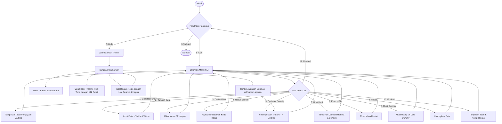

# Panduan & Dokumentasi Tugas Besar: Sistem Penjadwalan Ruangan Kampus

Proyek ini adalah implementasi lengkap solusi optimasi penjadwalan ruangan menggunakan **Algoritma Greedy** (*Activity Selection Problem*). Kode dibuat sangat rapi, terdokumentasi dengan baik, dan modular, sehingga siap dikumpulkan sebagai tugas besar terstruktur.

---

## 🛠️ Struktur File Proyek

Proyek ini terbagi menjadi 5 file utama:

1. 📂 **[main.py](file:///d:/Kuliah ITK/Materi Kuliah Semester 4/PAA/Tubes/main.py)**: Berperan sebagai pintu masuk program. Menyediakan menu pembuka untuk memilih antarmuka CLI atau GUI.
2. ⚙️ **[engine.py](file:///d:/Kuliah ITK/Materi Kuliah Semester 4/PAA/Tubes/engine.py)**: Berisi representasi objek data kelas (`Kuliah`), data dummy, logika utama **Algoritma Greedy**, dan utilitas ekspor file.
3. 🖥️ **[cli_interface.py](file:///d:/Kuliah ITK/Materi Kuliah Semester 4/PAA/Tubes/cli_interface.py)**: Mengelola visualisasi menu CLI, input data terminal dengan validasi ketat, cetak tabel ASCII, serta aksi pencarian dan penghapusan.
4. 🎨 **[gui_interface.py](file:///d:/Kuliah ITK/Materi Kuliah Semester 4/PAA/Tubes/gui_interface.py)**: Antarmuka GUI desktop berbasis `Tkinter` (Dark Mode) untuk memvisualisasikan linimasa jadwal kuliah secara interaktif dengan fitur filter real-time dan klik detail.
5. 🧪 **[test_scheduler.py](file:///d:/Kuliah ITK/Materi Kuliah Semester 4/PAA/Tubes/test_scheduler.py)**: File skrip pengujian otomatis (unit test) untuk memverifikasi logika kebenaran bebas bentrok.

---

## 🔄 Alur Program

Berikut adalah diagram alur program secara umum:



---

## 🌟 Fitur Baru Interaktif (Tahap 2)

Untuk meningkatkan fungsionalitas dan pengalaman pengguna yang dinamis, kami telah menambahkan fitur interaktif berikut:

1. **Hapus Jadwal Tertentu**:
   - **CLI (Menu 4)**: Pengguna dapat menghapus kelas tertentu dengan memasukkan kode kelas (misal: `C01`).
   - **GUI**: Pengguna cukup memilih baris jadwal pada tabel, lalu menekan tombol **"Hapus Kelas Terpilih"**. Jadwal visual dan status optimasi akan diperbarui secara otomatis.
2. **Cari & Filter Real-Time**:
   - **CLI (Menu 3)**: Memungkinkan pencarian data kelas secara spesifik berdasarkan nama mata kuliah atau ruangan.
   - **GUI**: Penambahan kolom **"Cari/Filter Kelas"** di atas tabel. Data pada tabel Treeview akan otomatis menyaring saat pengguna mengetik (filter berdasarkan nama kelas, ruangan, atau kode secara real-time).
3. **Ekspor Hasil Laporan**:
   - **CLI (Menu 7) & GUI (Tombol Ekspor Laporan)**: Menyimpan hasil optimasi (diterima & bentrok) ke berkas teks eksternal (default: `hasil_optimasi.txt`) dengan format yang rapi dan profesional untuk kebutuhan pelaporan tugas besar.
4. **Klik Detail Jadwal di Timeline (GUI)**:
   - Kotak jadwal pada timeline Canvas kini dapat diklik menggunakan mouse kiri.
   - Aplikasi akan mendeteksi klik tersebut dan memunculkan pop-up dialog rincian informasi kelas lengkap (Kode, Nama, Ruangan, Jam, Durasi dalam jam/menit, dan Status kelulusan optimasi).

---

## 🧠 Cara Kerja Greedy Algorithm (Activity Selection Problem)

Strategi greedy yang digunakan adalah **memilih kelas yang selesai paling cepat terlebih dahulu** (*earliest finish time first*).

### Rationale (Mengapa strategi ini optimal?)
Jika kita memilih kelas yang selesai lebih awal, ruangan akan dibebaskan secepat mungkin. Ruangan yang cepat kosong memiliki sisa waktu maksimum untuk diisi oleh kelas-kelas berikutnya. Hal ini dibuktikan secara matematis selalu menghasilkan jumlah kelas yang dijadwalkan secara maksimal dalam suatu ruangan.

### Langkah-Langkah Algoritma:
1. **Pengelompokkan per Ruangan**:
   Karena optimasi dilakukan untuk setiap ruangan secara independen, seluruh daftar kelas dikelompokkan berdasarkan nama ruangan ke dalam struktur data dictionary.
2. **Pengurutan (Sorting)**:
   Untuk setiap ruangan, semua kelas diurutkan berdasarkan **waktu selesai** (`selesai_menit`) secara *ascending* (meningkat). Jika ada waktu selesai yang sama, kelas diurutkan berdasarkan waktu mulai terawal.
3. **Seleksi Linier (Greedy Selection)**:
   - Ambil kelas pertama yang berada di urutan teratas (yang selesai paling cepat). Kelas ini dijamin masuk dalam daftar **Jadwal Diterima**.
   - Iterasi ke kelas-kelas berikutnya:
     - Bandingkan waktu mulai (`mulai_menit`) kelas saat ini dengan waktu selesai (`selesai_menit`) kelas terakhir yang berhasil dijadwalkan.
     - Jika `mulai_menit >= selesai_menit_terakhir`, maka kelas saat ini **Diterima** dan referensi kelas terakhir diperbarui ke kelas saat ini.
     - Jika `mulai_menit < selesai_menit_terakhir`, maka kelas saat ini **Bentrok** (Ditolak).

---

## 📈 Analisis Kompleksitas Algoritma

Algoritma ini memiliki kompleksitas keseluruhan sebesar **$O(n \log n)$**. Berikut rincian analisisnya:

### 1. Kompleksitas Waktu:
- **Pengelompokkan Kelas**: Mengelompokkan $n$ kelas ke dalam dictionary ruangan membutuhkan waktu linear **$O(n)$**.
- **Pengurutan (Sorting)**:
  Misalkan terdapat $R$ ruangan, dan ruangan ke-$i$ memiliki $n_i$ kelas, sehingga $\sum n_i = n$.
  Proses pengurutan untuk ruangan ke-$i$ menggunakan Timsort (fungsi `sorted` bawaan Python) membutuhkan waktu $O(n_i \log n_i)$.
  Total waktu pengurutan untuk semua ruangan adalah:
  $$\sum_{i=1}^{R} O(n_i \log n_i) \le O(n \log n)$$
- **Seleksi Linier**:
  Untuk setiap ruangan, kita melintasi kelas terurut sebanyak satu kali untuk memeriksa bentrok. Ini memakan waktu linear **$O(n)$** untuk seluruh ruangan.
  
**Total Kompleksitas Waktu**:
$$T(n) = O(n) + O(n \log n) + O(n) = \mathbf{O(n \log n)}$$

### 2. Kompleksitas Ruang:
- Menyimpan dictionary ruangan dan list hasil optimasi membutuhkan ruang memori tambahan sebesar **$O(n)$**.

---

## 💾 Struktur Data yang Digunakan

1. **Kelas Objek (`Class Kuliah`)**:
   Digunakan untuk membungkus properti dari sebuah kelas (Kode, Nama, Ruangan, Jam Mulai, Jam Selesai). Menyimpan pula konversi waktu ke menit (integer) untuk efisiensi komparasi.
2. **List (Larik)**:
   Digunakan untuk menampung seluruh daftar pengajuan kelas, daftar kelas yang diterima, dan daftar kelas yang bentrok.
3. **Dictionary (Peta/Asosiatif)**:
   Digunakan untuk memetakan nama ruangan (sebagai key) dengan list objek `Kuliah` yang diajukan pada ruangan tersebut (sebagai value).

---

## 🚀 Petunjuk Pengoperasian Program

Pastikan Anda berada di direktori proyek `d:\Kuliah ITK\Materi Kuliah Semester 4\PAA\Tubes`, lalu jalankan perintah berikut di terminal:

### 1. Menjalankan Menu Launcher Utama
```bash
python main.py
```
Anda akan disuguhkan menu interaktif untuk memilih masuk ke Mode CLI atau Mode GUI.

### 2. Menjalankan Langsung Mode GUI (Desktop Visual)
```bash
python main.py --gui
```

### 3. Menjalankan Langsung Mode CLI (Terminal)
```bash
python main.py --cli
```

### 4. Menjalankan Skrip Pengujian Otomatis
```bash
python test_scheduler.py
```

---

## 🧪 Hasil Pengujian (Validasi Program)

Ketika skrip `test_scheduler.py` dijalankan, hasilnya adalah:
```text
[...] Menjalankan pengujian algoritma...
[v] Sukses: Pengujian Berhasil! Algoritma menjamin tidak ada jadwal overlap.
    - Total Pengajuan: 14 kelas
    - Berhasil dijadwalkan secara optimal: 9 kelas
    - Bentrok disaring: 5 kelas
```

Ini membuktikan bahwa logika greedy yang ditulis berhasil mengeliminasi seluruh overlap jadwal kelas di setiap ruangan dengan sukses dan memberikan hasil yang optimal secara matematis.
