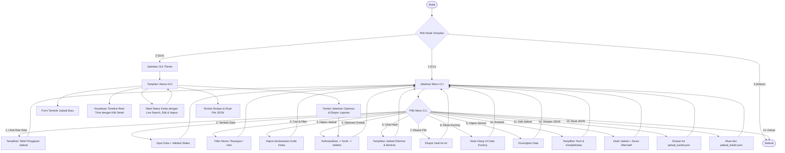

# Panduan & Dokumentasi Tugas Besar: Sistem Penjadwalan Ruangan Kampus

Proyek ini adalah implementasi lengkap solusi optimasi penjadwalan ruangan menggunakan **Algoritma Greedy** (*Activity Selection Problem*). Kode dibuat sangat rapi, terdokumentasi dengan baik, dan modular, sehingga siap dikumpulkan sebagai tugas besar terstruktur.

---

## 🛠️ Struktur File Proyek

Proyek ini terbagi menjadi 5 file utama:

1. 📂 **[main.py](file:///d:/Kuliah ITK/Materi Kuliah Semester 4/PAA/Tubes/main.py)**: Berperan sebagai pintu masuk program. Menyediakan menu pembuka untuk memilih antarmuka CLI atau GUI.
2. ⚙️ **[engine.py](file:///d:/Kuliah ITK/Materi Kuliah Semester 4/PAA/Tubes/engine.py)**: Berisi representasi objek data kelas (`Kuliah`), data dummy, logika utama **Algoritma Greedy**, validasi jam operasional (07:00 - 20:00), persistensi JSON, dan utilitas ekspor file.
3. 🖥️ **[cli_interface.py](file:///d:/Kuliah ITK/Materi Kuliah Semester 4/PAA/Tubes/cli_interface.py)**: Mengelola visualisasi menu CLI, input data terminal dengan validasi ketat, cetak tabel ASCII, serta aksi pencarian, penghapusan, pengeditan dengan saran otomatis, dan simpan/muat JSON.
4. 🎨 **[gui_interface.py](file:///d:/Kuliah ITK/Materi Kuliah Semester 4/PAA/Tubes/gui_interface.py)**: Antarmuka GUI desktop berbasis `Tkinter` (Dark Mode) untuk memvisualisasikan linimasa jadwal kuliah secara interaktif dengan fitur filter real-time, klik detail, pengeditan dengan saran otomatis, validasi jam operasional, dan simpan/muat JSON.
5. 🧪 **[test_scheduler.py](file:///d:/Kuliah ITK/Materi Kuliah Semester 4/PAA/Tubes/test_scheduler.py)**: File skrip pengujian otomatis (unit test) untuk memverifikasi logika kebenaran bebas bentrok.

---

## 🔄 Alur Program

Berikut adalah diagram alur program secara umum:



---

## 🌟 Fitur Unggulan Sistem Penjadwalan

Sistem ini didesain kaya fitur untuk memberikan solusi penjadwalan yang realistis dan komprehensif:

1. **Optimasi Greedy per (Ruangan, Hari)**:
   - Mengelompokkan kelas berdasarkan kombinasi ruangan dan hari kerja (Senin - Minggu) untuk mencegah bentrok secara tepat dan efisien.
2. **Saran Alternatif untuk Jadwal Bentrok**:
   - Jika kelas bentrok, sistem akan otomatis menganalisis dan merekomendasikan:
     - **Ruangan Alternatif**: Ruangan lain yang kosong pada hari dan jam yang sama.
     - **Waktu Alternatif**: Slot waktu kosong terdekat pada hari dan ruangan yang sama.
     - **Hari Alternatif**: Hari lain yang kosong pada ruangan dan jam yang sama.
3. **Validasi Jam Operasional Kampus**:
   - Mengharuskan seluruh jadwal berada di dalam rentang jam **07:00 s.d. 20:00**. Setiap input di luar jam ini akan ditolak secara otomatis baik di CLI maupun GUI.
4. **Persistensi Data JSON (Simpan & Muat)**:
   - Data jadwal dapat disimpan secara permanen ke file JSON (default: `jadwal_kuliah.json`) dan dimuat kembali kapan saja, sehingga data tidak hilang saat aplikasi ditutup.
5. **Daftar Ruangan Terstandar**:
   - Kampus didefinisikan dengan ruangan spesifik:
     - **Gedung E Lantai 1**: E101, E102, E103, E104, E105
     - **Gedung E Lantai 2**: E201, E202, E203, E204, E205
     - **Gedung E Lantai 3**: E301, E302, E303, E304, E305
     - **Laboratorium Komputer**: Lab Kom 1, Lab Kom 2

---

## 🧠 Cara Kerja Greedy Algorithm (Activity Selection Problem)

Strategi greedy yang digunakan adalah **memilih kelas yang selesai paling cepat terlebih dahulu** (*earliest finish time first*).

### Rationale (Mengapa strategi ini optimal?)
Jika kita memilih kelas yang selesai lebih awal, ruangan akan dibebaskan secepat mungkin. Ruangan yang cepat kosong memiliki sisa waktu maksimum untuk diisi oleh kelas-kelas berikutnya. Hal ini dibuktikan secara matematis selalu menghasilkan jumlah kelas yang dijadwalkan secara maksimal dalam suatu ruangan.

### Langkah-Langkah Algoritma:
1. **Pengelompokkan per (Ruangan, Hari)**:
   Karena optimasi dilakukan untuk setiap ruangan dan hari secara independen, seluruh daftar kelas dikelompokkan berdasarkan pasangan `(ruangan, hari)`.
2. **Pengurutan (Sorting)**:
   Untuk setiap kelompok, semua kelas diurutkan berdasarkan **waktu selesai** (`selesai_menit`) secara *ascending* (meningkat). Jika ada waktu selesai yang sama, kelas diurutkan berdasarkan waktu mulai terawal.
3. **Seleksi Linier (Greedy Selection)**:
   - Ambil kelas pertama yang berada di urutan teratas (yang selesai paling cepat). Kelas ini dijamin masuk dalam daftar **Jadwal Diterima**.
   - Iterasi ke kelas-kelas berikutnya:
     - Bandingkan waktu mulai (`mulai_menit`) kelas saat ini dengan waktu selesai (`selesai_menit`) kelas terakhir yang berhasil dijadwalkan.
     - Jika `mulai_menit >= selesai_menit_terakhir`, maka kelas saat ini **Diterima** dan referensi kelas terakhir diperbarui ke kelas saat ini.
     - Jika `mulai_menit < selesai_menit_terakhir`, maka kelas saat ini **Bentrok** (Ditolak).

---

## 📈 Analisis Kompleksitas Algoritma

Algoritma ini memiliki kompleksitas keseluruhan sebesar **$O(n \log n)$**. Berikut rincian analisisnya:

### 1. Kompleksitas Waktu:
- **Pengelompokkan Kelas**: Mengelompokkan $n$ kelas ke dalam dictionary ruangan-hari membutuhkan waktu linear **$O(n)$**.
- **Pengurutan (Sorting)**:
   Misalkan terdapat $R \times D$ kelompok (ruangan dan hari), dan kelompok ke-$i$ memiliki $n_i$ kelas, sehingga $\sum n_i = n$.
   Proses pengurutan untuk kelompok ke-$i$ menggunakan Timsort (fungsi `sorted` bawaan Python) membutuhkan waktu $O(n_i \log n_i)$.
   Total waktu pengurutan untuk semua kelompok adalah:
   $$\sum_{i} O(n_i \log n_i) \le O(n \log n)$$
- **Seleksi Linier**:
   Untuk setiap kelompok, kita melintasi kelas terurut sebanyak satu kali untuk memeriksa bentrok. Ini memakan waktu linear **$O(n)$** untuk seluruh kelompok.
   
**Total Kompleksitas Waktu**:
$$T(n) = O(n) + O(n \log n) + O(n) = \mathbf{O(n \log n)}$$

### 2. Kompleksitas Ruang:
- Menyimpan dictionary kelompok dan list hasil optimasi membutuhkan ruang memori tambahan sebesar **$O(n)$**.


## 🚀 Petunjuk Pengoperasian Program

Pastikan Anda berada di direktori proyek `d:\Kuliah ITK\Materi Kuliah Semester 4\PAA\Tubes`, lalu jalankan perintah berikut di terminal:

### 1. Menjalankan Menu Launcher Utama
```bash
python main.py
```
Anda akan disuguhkan menu interaktif untuk memilih masuk ke Mode CLI atau Mode GUI.

### 2. Menjalankan Langsung Mode GUI (Desktop Visual)
```bash
python main.py --gui
```

### 3. Menjalankan Langsung Mode CLI (Terminal)
```bash
python main.py --cli
```

### 4. Menjalankan Skrip Pengujian Otomatis
```bash
python test_scheduler.py
```
